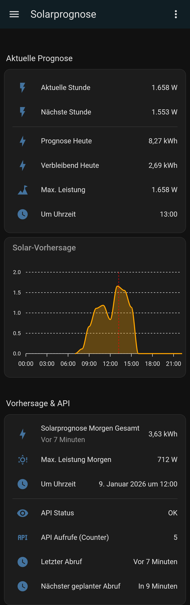

# Solarprognose.de (Community Integration for Home Assistant)

[](https://github.com/hacs/integration)

[🇩🇪 Deutsch](#-deutsch) | [🇺🇸 English](#-english)

---

<a name="-deutsch"></a>
## 🇩🇪 Deutsch

### WICHTIGER HINWEIS / HAFTUNGSAUSSCHLUSS
DIESE SOFTWARE WIRD **OHNE JEGLICHE GARANTIE** ZUR VERFÜGUNG GESTELLT. DIE NUTZUNG ERFOLGT **AUSSCHLIESSLICH AUF EIGENE GEFAHR**.
DER AUTOR ÜBERNIMMT **KEINERLEI HAFTUNG** FÜR:
- FALSCHE, UNVOLLSTÄNDIGE ODER VERALTETE PROGNOSEDATEN
- FINANZIELLE VERLUSTE, ENTGANGENE ERTRÄGE ODER FEHLENTSCHEIDUNGEN
- FEHLFUNKTIONEN, AUSFÄLLE ODER DATENVERLUSTE
- SCHÄDEN AN HARDWARE, SOFTWARE ODER PV-ANLAGEN
- FOLGESCHÄDEN JEGLICHER ART

INSBESONDERE SIND DIE BERECHNETEN PROGNOSEWERTE **NICHT** FÜR:
- ABRECHNUNGEN
- GARANTIE- ODER GEWÄHRLEISTUNGSZWECKE
- VERTRAGLICHE ODER RECHTLICHE ENTSCHEIDUNGEN
- KRITISCHE STEUERUNGEN GEEIGNET.

MIT DER INSTALLATION UND NUTZUNG DIESER INTEGRATION ERKLÄRST DU DICH AUSDRÜCKLICH DAMIT EINVERSTANDEN.

### Beschreibung
Diese Custom Integration bindet die WebAPI von Solarprognose.de ein. Es handelt sich um eine **nicht-offizielle Community-Integration**. Es besteht **keine Verbindung** zum Betreiber von Solarprognose.de.

### Funktionsumfang
- Prognose Heute / Morgen / Resttag
- Leistung aktuelle & nächste Stunde
- API-Status & Abfragezähler

### Installation (HACS)

> **Hinweis:** Diese Integration ist nicht Teil des offiziellen Home Assistant Core.

1. Diese Integration wird über **HACS (Home Assistant Community Store)** bereitgestellt und bietet folgende Vorteile einfache Installation, automatische Update-Hinweise, vertrauenswürdige Plattform
2. Weitere Informationen zur Installation findest du hier:  [HACS – Download & Installation](https://www.hacs.xyz/docs/use/download/download/)

### Installation via HACS (Empfohlen)
1. Öffne **HACS** in Home Assistant.
2. Gehe zu **Integrationen**.
3. Klicke oben rechts auf die drei Punkte und wähle **Benutzerdefinierte Repositories**.
4. Füge die URL hinzu: `https://github.com/matkoeout/solarprognose_de_community`
5. Wähle als Kategorie **Integration**.
6. Suche nach "Solarprognose.de (Community)" und installiere sie.
7. Starte Home Assistant neu.

### Manuelle Installation
1. Kopiere den Ordner `custom_components/solarprognose_de_community` in den lokalen `config/custom_components/` Ordner.
2. Home Assistant neu starten.

### API-Zugang erhalten (Kurzanleitung)
1. Um diese Integration zu nutzen, benötigst du einen Account bei Solarprognose.de:
2. Registriere dich auf Solarprognose.de.
3. Erstelle unter "Anlageneinstellungen" eine neue PV-Anlage.
4. Gehe zu "User-Einstellungen" -> "Schnittstelle / API".
5. Kopiere deinen API-Key für Einzelanlagen oder speziellere API-URLs für komplexe Konfigurationen.

### Konfiguration
1. Gehe zu **Einstellungen** -> **Geräte & Dienste**.
2. Klicke auf **Integration hinzufügen**.
3. Suche nach **Solarprognose.de (Community)**.
4. Gib deinen API-Key oder die API-URL ein.

### Dashboard Integration
Du kannst die Daten ganz einfach visualisieren. Ein vollständiges Beispiel für das neue **Abschnitte (Sections) Dashboard** findest du auf GitHub unter:  
`dashboards/solarprognose_de_community_section.yaml`

**Voraussetzung für den Graphen:**
Für die Anzeige des stündlichen Verlaufs wird die **ApexCharts-Card** benötigt. Diese kannst du ebenfalls über HACS installieren.

**Beispiel für eine einfache Integration:**
```yaml
type: vertical-stack
cards:
  - type: entities
    title: Solarvorhersage
    entities:
      - entity: sensor.solarprognose_today_total
      - entity: sensor.solarprognose_current_hour
  - type: custom:apexcharts-card
    graph_span: 24h
    series:
      - entity: sensor.solarprognose_forecast
        data_generator: |
          return entity.attributes.forecast.map((entry) => {
            return [new Date(entry.datetime).getTime(), entry.energy];
          });
  - type: vertical-stack
    cards:
      - type: heading
        heading: Vorhersage & API
      - type: entities
        entities:
          - entity: sensor.solarprognose_morgen_gesamt
            secondary_info: last-updated
          - type: divider
          - entity: sensor.solarprognose_api_status
            name: API Status
          - entity: sensor.solarprognose_api_abfragen_heute
            name: API Aufrufe (Counter)
          - entity: sensor.solarprognose_letzte_abfrage
            name: Letzter Abruf
          - entity: sensor.solarprognose_nachste_abfragezeit
            name: Nächster geplanter Abruf
```
### Sampledashboard in mobile app
[Sceenshot](#-screenshot)

### Sensoren
* **Energie:** today_total, tomorrow_total, rest_day, forecast, current_hour, next_hour
* **Status:** api_status, api_count, last_update, next_update

### Lizenz
MIT Lizenz.
---

<a name="-english"></a>
## 🇺🇸 English

### IMPORTANT NOTICE / DISCLAIMER
THIS SOFTWARE IS PROVIDED **WITHOUT ANY WARRANTY**. USE AT **YOUR OWN RISK**.
THE AUTHOR ASSUMES **NO** LIABILITY FOR:
- INCORRECT, INCOMPLETE OR OUTDATED FORECAST DATA
- FINANCIAL LOSSES, LOST PROFITS OR WRONG DECISIONS
- MALFUNCTIONS, FAILURES OR DATA LOSS
- DAMAGE TO HARDWARE, SOFTWARE OR PV SYSTEMS
- CONSEQUENTIAL DAMAGES OF ANY KIND

IN PARTICULAR, THE CALCULATED FORECAST VALUES ARE **NOT** SUITABLE FOR:
- BILLING PURPOSES
- WARRANTY OR GUARANTEE PURPOSES
- CONTRACTUAL OR LEGAL DECISIONS
- CRITICAL CONTROLS

BY INSTALLING AND USING THIS INTEGRATION, YOU EXPRESSLY AGREE TO THESE TERMS.

### Description
This custom integration connects the Solarprognose.de WebAPI to Home Assistant. This is an **unofficial community integration** and has no affiliation with the operators of Solarprognose.de.

### Features
- Forecast Today / Tomorrow / Remaining Day
- Power Current & Next Hour
- API Status & Request Counter
- Next update time tracking

### Installation (HACS)

> **Note:** This integration is not part of the official Home Assistant Core.

1. This integration is distributed via **HACS (Home Assistant Community Store)** and provides the following benefits easy installation, update notifications, trusted distribution platform.
2. Please follow the instructions in the official HACS documentation:  [HACS – Download & Installation](https://www.hacs.xyz/docs/use/download/download/)

### Installation via HACS (Recommended)
1. Open **HACS** in Home Assistant.
2. Go to **Integrations**.
3. Click the three dots in the top right corner and select **Custom repositories**.
4. Add the URL: `https://github.com/matkoeout/solarprognose_de_community`
5. Select **Integration** as the category.
6. Search for "Solarprognose.de (Community)" and install it.
7. Restart Home Assistant.

### Manual Installation
1. Copy the folder `custom_components/solarprognose_de_community` to your `config/custom_components/` directory.
2. Restart Home Assistant.

### How to get API Access
1. Register at Solarprognose.de.
2. Go to "System Settings" (Anlageneinstellungen) and create your PV system.
3. Navigate to "User Settings" -> "API / Interface".
4. Copy your API Key für single systems or the full API URL for more complex configurations.

### Configuration
1. Go to **Settings** -> **Devices & Services**.
2. Click **Add Integration**.
3. Search for **Solarprognose.de (Community)**.
4. Enter your API Key or API URL.

### Dashboard Integration
You can easily visualize the forecast data. A complete example for the new Sections Dashboard can be found on GitHub:  
`dashboards/solarprognose_de_community_section.yaml`

**Prerequisite for the Graph:**
To display the hourly forecast, the ApexCharts-Card is required. You can install it via HACS as well.

**Simple Integration Example:**
```yaml
type: vertical-stack
cards:
  - type: entities
    title: Solarforecast
    entities:
      - entity: sensor.solarprognose_today_total
      - entity: sensor.solarprognose_current_hour
  - type: custom:apexcharts-card
    graph_span: 24h
    series:
      - entity: sensor.solarprognose_forecast
        data_generator: |
          return entity.attributes.forecast.map((entry) => {
            return [new Date(entry.datetime).getTime(), entry.energy];
          });
  - type: vertical-stack
    cards:
      - type: heading
        heading: Forecast & API
      - type: entities
        entities:
          - entity: sensor.solarprognose_morgen_gesamt
            secondary_info: last-updated
          - type: divider
          - entity: sensor.solarprognose_api_status
            name: API status
          - entity: sensor.solarprognose_api_abfragen_heute
            name: API calls (Counter)
          - entity: sensor.solarprognose_letzte_abfrage
            name: Last call Abruf
          - entity: sensor.solarprognose_nachste_abfragezeit
            name: next call
```

### Sensors
* **Energy:** today_total, tomorrow_total, rest_day, forecast, current_hour, next_hour
* **Status:** api_status, api_count, last_update, next_update

### License
MIT License.

<a name="-screenshot"></a>
### Sampledashboard in mobile app


