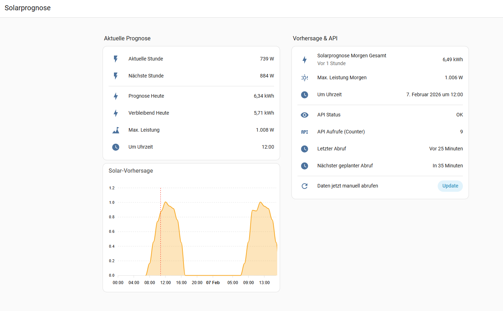
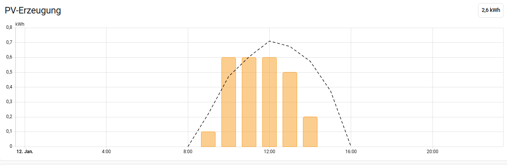
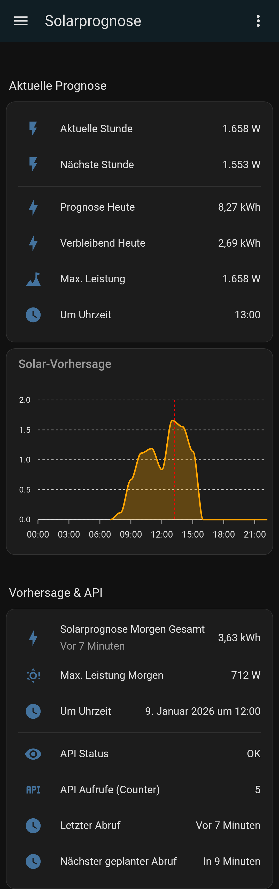

# Solarprognose.de (Community Integration for Home Assistant)

[](https://github.com/hacs/integration)

[🇩🇪 Deutsch](#-deutsch) | [🇺🇸 English](#-english)

---

<a name="-deutsch"></a>
## 🇩🇪 Deutsch

### WICHTIGER HINWEIS / HAFTUNGSAUSSCHLUSS
DIESE SOFTWARE WIRD **OHNE JEGLICHE GARANTIE** ZUR VERFÜGUNG GESTELLT. DIE NUTZUNG ERFOLGT **AUSSCHLIESSLICH AUF EIGENE GEFAHR**.
DER AUTOR ÜBERNIMMT **KEINERLEI HAFTUNG** FÜR:
- FALSCHE, UNVOLLSTÄNDIGE ODER VERALTETE PROGNOSEDATEN
- FINANZIELLE VERLUSTE, ENTGANGENE ERTRÄGE ODER FEHLENTSCHEIDUNGEN
- FEHLFUNKTIONEN, AUSFÄLLE ODER DATENVERLUSTE
- SCHÄDEN AN HARDWARE, SOFTWARE ODER PV-ANLAGEN
- FOLGESCHÄDEN JEGLICHER ART

INSBESONDERE SIND DIE BERECHNETEN PROGNOSEWERTE **NICHT** FÜR:
- ABRECHNUNGEN
- GARANTIE- ODER GEWÄHRLEISTUNGSZWECKE
- VERTRAGLICHE ODER RECHTLICHE ENTSCHEIDUNGEN
- KRITISCHE STEUERUNGEN GEEIGNET.

MIT DER INSTALLATION UND NUTZUNG DIESER INTEGRATION ERKLÄRST DU DICH AUSDRÜCKLICH DAMIT EINVERSTANDEN.

### Beschreibung
Diese Custom Integration bindet die WebAPI von Solarprognose.de ein. Es handelt sich um eine **nicht-offizielle Community-Integration**. Es besteht **keine Verbindung** zum Betreiber von Solarprognose.de.

### Funktionsumfang
- Prognose Heute / Morgen / Resttag / Zeitpunkt der Spitzenleistung heute und morgen
- Einbindung in das Energiedashboard
- Leistung aktuelle & nächste Stunde
neu in 1.8.0
- Dynamische Abfrageintervalle: Nutzt die API-Empfehlung (`preferredNextApiRequestAt`) für optimale Aktualisierungszeiten.
- Nachtruhe zwischen 21 und 3 Uhr um das API Limit von 20 Abfragen pro Tag nicht zu erreichen
- Fehlertoleranz: Automatischer Retry nach 60 Minuten bei Verbindungsfehlern.
- Manueller Update-Service: Sofortige Aktualisierung via Service-Call möglich.
neu in 1.9.0
- Lokale Datenbereitstellung für EVCC

### Installation (HACS)

> **Hinweis:** Diese Integration ist nicht Teil des offiziellen Home Assistant Core.

1. Diese Integration wird über **HACS (Home Assistant Community Store)** bereitgestellt und bietet folgende Vorteile einfache Installation, automatische Update-Hinweise, vertrauenswürdige Plattform
2. Weitere Informationen zur Installation findest du hier:  [HACS – Download & Installation](https://www.hacs.xyz/docs/use/download/download/)

### Installation via HACS (Empfohlen)
1. Öffne **HACS** in Home Assistant.
2. Gehe zu **Integrationen**.
3. Klicke oben rechts auf die drei Punkte und wähle **Benutzerdefinierte Repositories**.
4. Füge die URL hinzu: `https://github.com/matkoeout/solarprognose_de_community`
5. Wähle als Kategorie **Integration**.
6. Suche nach "Solarprognose.de (Community)" und installiere sie.
7. Starte Home Assistant neu

### Manuelle Installation
1. Kopiere den Ordner `custom_components/solarprognose_de_community` in den lokalen `config/custom_components/` Ordner.
2. Home Assistant neu starten.

### API-Zugang erhalten (Kurzanleitung)
1. Um diese Integration zu nutzen, benötigst du einen Account bei Solarprognose.de:
2. Registriere dich auf Solarprognose.de.
3. Erstelle unter "Anlageneinstellungen" eine neue PV-Anlage.
4. Gehe zu "User-Einstellungen" -> "Schnittstelle / API".
5. Kopiere deinen API-Key für Einzelanlagen oder speziellere API-URLs für komplexe Konfigurationen.

### Konfiguration
1. Gehe zu **Einstellungen** -> **Geräte & Dienste**.
2. Klicke auf **Integration hinzufügen**.
3. Suche nach **Solarprognose.de (Community)**.
4. Gib deinen API-Key oder die API-URL ein.

### Dashboard Integration
Du kannst die Daten ganz einfach visualisieren. Ein vollständiges Beispiel für das neue **Abschnitte (Sections) Dashboard** findest du auf GitHub unter:  
`dashboards/solarprognose_de_community_section.yaml`

**Voraussetzung für den Graphen:**
Für die Anzeige des stündlichen Verlaufs wird die **ApexCharts-Card** benötigt. Diese kannst du ebenfalls über HACS installieren.

**Beispiel mit manuellem Update-Button:**
```yaml
type: vertical-stack
cards:
  - type: entities
    title: Solarvorhersage & Status
    entities:
      - entity: sensor.solarprognose_today_total
      - entity: sensor.solarprognose_current_hour
      - entity: sensor.solarprognose_next_hour
      - entity: sensor.solarprognose_api_status
      - entity: sensor.solarprognose_letzte_abfrage
      - entity: sensor.solarprognose_nachste_abfragezeit
  - type: custom:apexcharts-card
    graph_span: 24h
    series:
      - entity: sensor.solarprognose_forecast
        data_generator: |
          return entity.attributes.forecast.map((entry) => {
            return [new Date(entry.datetime).getTime(), entry.energy];
          });
  - type: vertical-stack
    cards:
      - type: heading
        heading: Vorhersage & API
      - type: entities
        entities:
          - entity: sensor.solarprognose_morgen_gesamt
            secondary_info: last-updated
          - type: divider
          - entity: sensor.solarprognose_api_status
            name: API Status
          - entity: sensor.solarprognose_api_abfragen_heute
            name: API Aufrufe (Counter)
          - entity: sensor.solarprognose_letzte_abfrage
            name: Letzter Abruf
          - entity: sensor.solarprognose_nachste_abfragezeit
            name: Nächster geplanter Abruf
          - type: divider
          - type: button
            name: Daten jetzt manuell abrufen
            icon: mdi:refresh
            action_name: Update
            tap_action:
              action: call-service
              service: solarprognose_de_community.solarprognose_update```
```
### EVCC Anbindung
Diese Integration dient als intelligenter Puffer: Sie nutzt die vorhandenen Entitäten in Home Assistant, um evcc mit präzisen Daten zu versorgen, während gleichzeitig die API-Zugriffsbeschränkungen von Solarprognose.de eingehalten werden.

Anleitung: PV-Vorhersage in der evcc UI hinzufügen
#### Erstellen eine langlaufenden Zugangstokens in HA
1. Profil öffnen: Klicke in Home Assistant ganz unten links auf deinen Benutzernamen (dein Profil-Icon).
2. Sicherheit wählen: Klicke oben in der Mitte auf den Reiter Sicherheit (neben "Allgemein").
3. Ganz nach unten scrollen: Scrolle auf der Sicherheits-Seite bis ganz nach unten zum Abschnitt Langlebige Zugangs-Token.
4. Token erstellen: Klicke auf die Schaltfläche Token erstellen.
5. Namen vergeben: Gib dem Token einen Namen, damit du später weißt, wofür er ist (z. B. evcc-prognose).
6. Kopieren (Wichtig!): Dir wird jetzt ein sehr langer Code angezeigt. Kopiere diesen sofort und speichere ihn kurz in einem Textdokument zwischen.
7. Hinweis: Sobald du das Fenster schließt, wird dir der Key nie wieder im Klartext angezeigt. Wenn du ihn verlierst, musst du einen neuen erstellen.1. evcc UI öffnen: Öffne dein evcc Dashboard im Browser (standardmäßig auf Port 7070).

#### Konfigurieren der PV Vorhersage in EVCC
1. evcc UI öffnen: Öffne dein evcc Dashboard im Browser (standardmäßig auf Port 7070).
2. Konfiguration aufrufen: Klicke in der Seitenleiste auf Konfiguration (Zahnrad-Symbol).
3. Tarife & Vorhersagen: Scrolle zum Abschnitt "Tarife & Vorhersagen".
4. Klicke auf "Hinzufügen"
5. Klicke auf "Vorhersage hinzufügen".
6. Wähle "Solarvorhersage hinzufügen".
7. Gib einen Namen ein (z. B. "Solarprognose HA").
8. Wähle als Anbieter "Benutzerdefiniert" (Custom).
9. YAML-Code eintragen: Kopiere den folgenden Block in das Textfeld.
```yaml
tariff: solar
forecast: 
  source: http
  uri: "http://<Deine_HA_IP_Oder_URL:8123>/api/states/sensor.solarprognose_prognose"
  headers:
    Authorization: "Bearer <Dein_Langlaufender_Zugangs_Token>"
  jq: .attributes.evcc_data
  cache: 1h
```
10. Klicke auf "Speichern". evcc prüft die Verbindung sofort. Nach einem Neustart von EVCC werden die Daten dargestellt.
    
### Sampledashboards
[Screenshot](#-screenshot)

### Sensoren
* **Energie:** today_total, tomorrow_total, rest_day, forecast, current_hour, next_hour
* **Status:** api_status, api_count, last_update, next_update

### Lizenz
MIT Lizenz.
---

<a name="-english"></a>
## 🇺🇸 English

### IMPORTANT NOTICE / DISCLAIMER
THIS SOFTWARE IS PROVIDED **WITHOUT ANY WARRANTY**. USE AT **YOUR OWN RISK**.
THE AUTHOR ASSUMES **NO** LIABILITY FOR:
- INCORRECT, INCOMPLETE OR OUTDATED FORECAST DATA
- FINANCIAL LOSSES, LOST PROFITS OR WRONG DECISIONS
- MALFUNCTIONS, FAILURES OR DATA LOSS
- DAMAGE TO HARDWARE, SOFTWARE OR PV SYSTEMS
- CONSEQUENTIAL DAMAGES OF ANY KIND

IN PARTICULAR, THE CALCULATED FORECAST VALUES ARE **NOT** SUITABLE FOR:
- BILLING PURPOSES
- WARRANTY OR GUARANTEE PURPOSES
- CONTRACTUAL OR LEGAL DECISIONS
- CRITICAL CONTROLS

BY INSTALLING AND USING THIS INTEGRATION, YOU EXPRESSLY AGREE TO THESE TERMS.

### Description
This custom integration connects the Solarprognose.de WebAPI to Home Assistant. This is an **unofficial community integration** and has no affiliation with the operators of Solarprognose.de.

### Features
- Forecast Today / Tomorrow / Remaining Day / time for peakpower today and tomorrow
- Supporting the energy dashboard
- Power Current & Next Hour
- API Status & Request Counter
- Next update time tracking
new in 1.8.0
- Dynamic Update Intervals: Automatically follows API recommendations (preferredNextApiRequestAt).
- Implement night-time suspension between 9 PM and 3 AM to stay within the API limit of 20 requests per day.
- Error Handling: Automatic 60-minute retry on connection failures.
- Manual Update Service: Force updates instantly via service call.
new in 1.9.0
- Local data Provisioning for EVCC

### Installation (HACS)

> **Note:** This integration is not part of the official Home Assistant Core.

1. This integration is distributed via **HACS (Home Assistant Community Store)** and provides the following benefits easy installation, update notifications, trusted distribution platform.
2. Please follow the instructions in the official HACS documentation:  [HACS – Download & Installation](https://www.hacs.xyz/docs/use/download/download/)

### Installation via HACS (Recommended)
1. Open **HACS** in Home Assistant.
2. Go to **Integrations**.
3. Click the three dots in the top right corner and select **Custom repositories**.
4. Add the URL: `https://github.com/matkoeout/solarprognose_de_community`
5. Select **Integration** as the category.
6. Search for "Solarprognose.de (Community)" and install it.
7. Restart Home Assistant.

### Manual Installation
1. Copy the folder `custom_components/solarprognose_de_community` to your `config/custom_components/` directory.
2. Restart Home Assistant.

### How to get API Access
1. Register at Solarprognose.de.
2. Go to "System Settings" (Anlageneinstellungen) and create your PV system.
3. Navigate to "User Settings" -> "API / Interface".
4. Copy your API Key für single systems or the full API URL for more complex configurations.

### Configuration
1. Go to **Settings** -> **Devices & Services**.
2. Click **Add Integration**.
3. Search for **Solarprognose.de (Community)**.
4. Enter your API Key or API URL.

### Dashboard Integration
You can easily visualize the forecast data. A complete example for the new Sections Dashboard can be found on GitHub:  
`dashboards/solarprognose_de_community_section.yaml`

**Prerequisite for the Graph:**
To display the hourly forecast, the ApexCharts-Card is required. You can install it via HACS as well.

**Simple Integration Example:**
```yaml
type: vertical-stack
cards:
  - type: entities
    title: Solarvorhersage & Status
    entities:
      - entity: sensor.solarprognose_today_total
      - entity: sensor.solarprognose_current_hour
      - entity: sensor.solarprognose_next_hour
      - entity: sensor.solarprognose_api_status
      - entity: sensor.solarprognose_letzte_abfrage
      - entity: sensor.solarprognose_nachste_abfragezeit
  - type: custom:apexcharts-card
    graph_span: 24h
    series:
      - entity: sensor.solarprognose_forecast
        data_generator: |
          return entity.attributes.forecast.map((entry) => {
            return [new Date(entry.datetime).getTime(), entry.energy];
          });
  - type: vertical-stack
    cards:
      - type: heading
        heading: Vorhersage & API
      - type: entities
        entities:
          - entity: sensor.solarprognose_morgen_gesamt
            secondary_info: last-updated
          - type: divider
          - entity: sensor.solarprognose_api_status
            name: API Status
          - entity: sensor.solarprognose_api_abfragen_heute
            name: API Aufrufe (Counter)
          - entity: sensor.solarprognose_letzte_abfrage
            name: Letzter Abruf
          - entity: sensor.solarprognose_nachste_abfragezeit
            name: Nächster geplanter Abruf
          - type: divider
          - type: button
            name: Daten jetzt manuell abrufen
            icon: mdi:refresh
            action_name: Update
            tap_action:
              action: call-service
              service: solarprognose_de_community.solarprognose_update```
```

### Sensors
* **Energy:** today_total, tomorrow_total, rest_day, forecast, current_hour, next_hour
* **Status:** api_status, api_count, last_update, next_update

### EVCC Integration
Since the Solarprognose API limits the number of direct requests, this extension allows you to bypass those restrictions by querying the data already available in Home Assistant. By leveraging the data Home Assistant has already fetched, you can provide evcc with high-frequency updates without exceeding your external API quotas.
Instructions: Adding PV Forecast in the evcc UI

#### Creating a Long-lived Access Token in HA
1. **Open Profile:** Click on your username (profile icon) in the bottom left corner of Home Assistant.
2. **Select Security:** Click on the **Security** tab at the top center (next to "General").
3. **Scroll to the bottom:** Scroll down to the bottom of the Security page to the **Long-lived Access Tokens** section.
4. **Create Token:** Click the **Create Token** button.
5. **Assign a Name:** Give it a name so you’ll know what it’s for later (e.g., `evcc-forecast`).
6. **Copy (Important!):** A very long code will now be displayed. Copy it immediately and save it temporarily in a text document.
7. **Note:** Once you close the window, the key will never be displayed in plain text again. If you lose it, you must create a new one.

#### Configuring the PV Forecast in EVCC
1. **Open evcc UI:** Open your evcc dashboard in your browser (default is port 7070).
2. **Open Configuration:** Click on **Configuration** (gear icon) in the sidebar.
3. **Tariffs & Forecasts:** Scroll to the **"Tariffs & Forecasts"** section.
4. **Add:** Click on **"Add Forecast"**.
5. **Select:** Select **"Add Solar Forecast"**.
6. **Set Name:** Enter a name (e.g., "Solar Forecast HA").
7. **Choose Provider:** Select **"Custom"** (Benutzerdefiniert) as the provider.
8. **Enter YAML Code:** Copy the following block into the text field:

```yaml
tariff: solar
forecast: 
  source: http
  uri: "http://<Your_HA_IP_or_URL:8123>/api/states/sensor.solarprognose_prognose"
  headers:
    Authorization: "Bearer <your_long_lived_access_token>"
  jq: .attributes.evcc_data
  cache: 1h
```
9. **Save:** Click on "Save". evcc will verify the connection immediately. After restarting evcc, the data will be visible.
    
### License
MIT License.

<a name="-screenshot"></a>
### Sampledashboards




	
